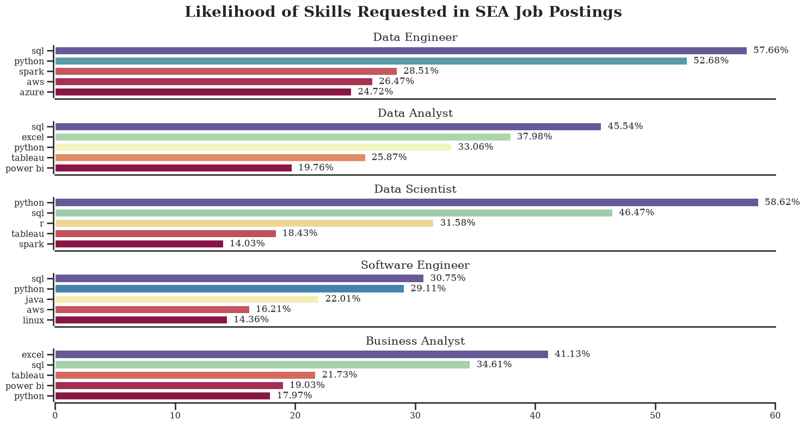

# Overview

# The Questions

I would love to answer the following questions in project:

1. What are the skills most in demand for the top 5 most popular data roles in SEA?
2. How are acquired skills trending for the top 5 jobs?
3. How well each skill and job pay for the top 5 roles?
4. What are the optimal skills for all 5 roles of the top to learn? (High Demand and High Paying)

# Tools I Utilized

For my attempt to explore the top 5 jobs in this dataset, I took advantage if several key tools that I'm intructed by Luke Barousse:

- **Python:** the main tool of my analysis, allowing me to analyze the data and find critical insights. I also used the following Python libraries:
  - **Pandas Library:** This was used to analyze the data.
  - **Matplotlib Library:** I visualized the data.
  - **Seaborn Library:** Helped me create more advanced visuals.
- **Jupyter Notebooks:** The tool I used to run my Python scripts which let me easily include my notes and analysis.
- **Visual Studio Code:** My code editor for executing my Python scripts.
- **Git & GitHub:** Essential for version control and sharing my Python code and analysis, ensuring collaboration and project tracking.

# Data Preparation and Cleanup

This section outlines the steps taken to prepare the data for analysis, ensuring accuracy and usability.

## Import & Clean Up Data

I start by importing necessary libraries and loading the dataset, followed by initial data cleaning tasks to ensure data quality.

```python
# Import library
import pandas as pd
import numpy as np
import ast
from datasets import load_dataset
import matplotlib.pyplot as plt
import seaborn as sns

#Loading Dataset
dataset = load_dataset('lukebarousse/data_jobs')
df = dataset['train'].to_pandas()

#Data Cleanup
df['job_posted_date'] = pd.to_datetime(df['job_posted_date'])
df['job_skills'] = df['job_skills'].apply(lambda skill: ast.literal_eval(skill) if pd.notna(skill) else skill)
```

## Filter SEA Jobs

```python
# Countries belong to Southeast Asia
countries = ['Brunei', 'Cambodia', 'Indonesia', 'Laos', 'Malaysia' , 'Myanmar'
             , 'Philippines', 'Singapore', 'Thailand', 'East Timor', 'Vietnam']
```

```
df_SEA = df[df['job_country'].isin(countries)]
```

# The Analysis

Each Jupyter notebook for this project aimed at investigating specific aspects of the dataset. Here’s how I approached each question:

## 1. What are the most demanded skills for the top 3 most popular data roles?

To find the most demanded skills for the top 5 most popular roles. I filtered out those positions by which ones were the most popular, and got the top 5 skills for these top 5 roles. This query highlights the most popular job titles and their top skills, showing which skills I should pay attention to depending on the role I'm targeting.

View my notebook with detailed steps here: [2_Skill_Demand](2_Skill_Demand.ipynb).

```python
fig, ax = plt.subplots(
                        len(top5_job_title)
                        , 1
                        , figsize = (15, 8))

sns.set_theme(
                style='ticks'
                , palette = 'Spectral'
                , context="talk"
                , font = 'serif'
                , font_scale = 0.7)

for index, job in enumerate(top5_job_title):
    df_plot = df_skill_percent[df_skill_percent['job_title_short'] == job].head()[::-1]
    sns.barplot(
                data = df_plot
                , x = 'skill_percent'
                , y = 'job_skills'
                , ax = ax[index]
                , hue = 'skill_percent'
                , palette = 'Spectral'
                , legend = False)

    ax[index].set_title(
                        job
                        , fontsize = 15
                        , loc = 'center')

    ax[index].invert_yaxis()
    ax[index].set_ylabel('')
    ax[index].set_xlabel('')
    ax[index].set_xlim(0, 60) # make the scales the same

    # Remove the percentage on first four bar charts
    if index != len(top5_job_title) - 1:
        ax[index].set_xticks([])

    # Label the percentage on all bar charts
    for n, v in enumerate(df_plot['skill_percent']):
        ax[index].text(v + 0.5, n, f'{v:.2f}%', va = 'center')


sns.despine(offset=2)
fig.suptitle(
            'Likelihood of Skills Requested in SEA Job Postings'
            , fontsize=20
            , fontweight = 'bold')

fig.tight_layout(h_pad=1) # fix the overlap
plt.show()
```

### The Result



_Bar graph visualizing the percentages of skill requested for the top 5 jobs and their top 5 skills associated with each one._

### Insights:

#### Overall Trend

- SQL and Python are universal skills:
  - SQL demand ranges from 30.75% (Software Engineer) up to 57.66% (Data Engineer).

  - Python is consistently high, peaking at 58.62% (Data Scientist) and 52.68% (Data Engineer).

- Excel remains critical for business-oriented roles:
  - 41.13% of Business Analyst postings and 37.98% of Data Analyst postings require Excel.

  - In contrast, Excel demand is negligible for Data Engineers and Software Engineers.

- Visualization tools are role-specific:
  - Tableau and Power BI are strong for Analysts (25.87% and 19.76% for Data Analyst; 21.73% and 19.03% for Business Analyst).

  - Their relevance drops below 20% for technical roles like Data Scientist and Engineer.

- Cloud & Big Data skills are concentrated in technical roles:
  - Spark (28.51%) and AWS (26.47%) are key for Data Engineers.

  - Software Engineers also show demand for AWS (16.21%) and Linux (14.36%).

- Key Takeaways
  - Python is emerging as the common language across data-related roles.

  - SQL remains a non-negotiable foundation skill across all positions.

  - Business-focused roles (Analyst, BA) emphasize Excel + Visualization, while technical roles (Engineer, Scientist, SE) prioritize Python + Cloud/Big Data.

## 2. How are in-demand skills trending for Top 5 jobs?

To find how skills are trending of job dataset in 2023 for top 5 jobs in SEA, I filtered the top 5 positions and grouped the skills by the month of the job postings. This helped me get the top 5 skills of top 5 positions by month, showing how popular skills were throughout 2023.

Look through my notebook with detailed steps here: [3_SKill_Trend](3_Skill_Trend.ipynb).

```python
df_plot = df_SEA_pivot_percent.iloc[:, :5]

fig, ax = plt.subplots(figsize = (15, 8))
sns.set_theme(
                style='ticks'
                , palette = 'tab10'
                , context="talk"
                , font = 'serif'
                , font_scale = 0.7)

sns.lineplot(
                data = df_plot
                , dashes=False
                , linewidth = 4
                , linestyle = '-'
                , markersize = 8
                , marker = 'o'
                , color = 'black'
                , legend=False)

sns.despine(offset=2) # remove top and right spines

plt.title(
            'Trending Top SKills for Top 5 Roles in SEA'
            , fontdict={'fontsize': 25, 'fontweight': 'bold'})

plt.xlabel(
            '2023'
            , fontdict={'fontsize': 20})

plt.ylabel(
            'Likelihood of Job Postings'
            , fontdict={'fontsize': 20})

plt.gca().yaxis.set_major_formatter(PercentFormatter(decimals=0))
plt.gca().tick_params(axis='x', labelsize = 15)
plt.gca().tick_params(axis='y', labelsize = 15)
plt.ylim(0, 60)

# Annotate the plot with the top 5 skills using plt.text()
for index in range(5):
    plt.text(
                len(df_plot.index) - 0.9
                , df_plot.iloc[-1, index]
                , df_plot.columns[index]
                , color = 'black'
                , fontdict={'fontsize': 15})

plt.show()
```

### The Results


_Bar graph demonstrates the trending top skills for top 5 roles in SEA in 2023._

### Insights:

#### Trends Over Time

- SQL: Consistently the top skill, fluctuating around 45–50%. It remains a foundational and almost mandatory requirement in most job postings.

- Python: Second in demand, stable at 40–43%, highlighting its role as the common programming language across data-related positions.

- Excel: Maintains a mid-level presence at 22–25%, primarily supporting business-oriented roles such as Data Analyst and Business Analyst.

- Tableau: Steady at 17–20%, reflecting stable but not explosive demand for visualization capabilities.

- Power BI: Lowest demand at 12–15%, yet still relevant for Business Analyst and Data Analyst roles.

#### Key Insights

- SQL and Python are core pillars: Their consistently high demand throughout the year confirms they are long-term essentials rather than short-lived trends.

- Excel remains resilient: While less critical for technical roles, it continues to hold steady importance for business-focused positions.

- Visualization tools (Tableau, Power BI): Demand is stable but not accelerating, indicating they serve as complementary rather than core skills.

- No sharp fluctuations across skills: The 2023 trend line is relatively flat, suggesting the SEA job market has already established a clear and stable skill set requirement.

## 3. How well each skill and job pay for the top 5 roles?

To identify the highest-paying roles and skills, I only got jobs in Southeast Asia and take a look at their mean salary. But first I had to look at the salary distributions of popular jobs like Data Analyst, Data Engineer and Data Scientist in order to get an idea of which jobs are paid the most.

View my notebook with detailed steps here: [4_Salary_Analysis](4_Salary_Trend.ipynb)
