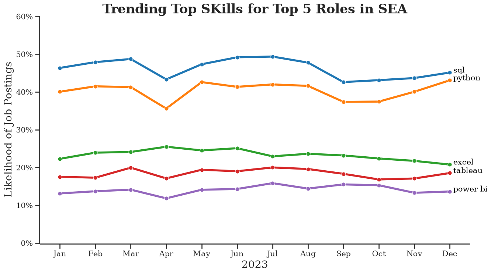
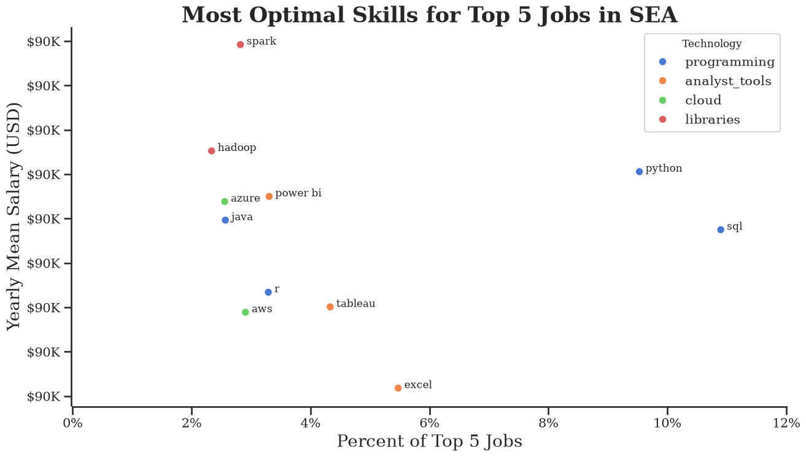

# 📘 Overview

Welcome to my analysis of job market dataset. This project explores the top 5 most popular data roles in Southeast Asia (SEA) by analyzing job postings and salary data. Using Python and key libraries (Pandas, Matplotlib, Seaborn), I explore key questions such as the most demanded skills, salary trends, and the intersection of demand and salary in top 5 job titles. The study investigates four main questions:

### 📌 The Questions

I would love to answer the following questions in project:

1. What are the skills most in demand for the top 5 most popular data roles in SEA?
2. How are acquired skills trending for the top 5 jobs?
3. How well each skill and job pay for the top 5 roles?
4. What are the optimal skills for all 5 roles of the top to learn? (High Demand and High Paying)

# Tools I Utilized

For my attempt to explore the top 5 jobs in this dataset, I took advantage if several key tools that I'm intructed by Luke Barousse:

- **Python:** the main tool of my analysis, allowing me to analyze the data and find critical insights. I also used the following Python libraries:
  - **Pandas Library:** This was used to analyze the data.
  - **Matplotlib Library:** I visualized the data.
  - **Seaborn Library:** Helped me create more advanced visuals.
- **Jupyter Notebooks:** The tool I used to run my Python scripts which let me easily include my notes and analysis.
- **Visual Studio Code:** My code editor for executing my Python scripts.
- **Git & GitHub:** Essential for version control and sharing my Python code and analysis, ensuring collaboration and project tracking.

# 📂 Data Preparation and Cleanup

This section outlines the steps taken to prepare the data for analysis, ensuring accuracy and usability.

## 📥 Import & Clean Up Data

I start by importing necessary libraries and loading the dataset, followed by initial data cleaning tasks to ensure data quality.

```python
# Import library
import pandas as pd
import numpy as np
import ast
from datasets import load_dataset
import matplotlib.pyplot as plt
import seaborn as sns

#Loading Dataset
dataset = load_dataset('lukebarousse/data_jobs')
df = dataset['train'].to_pandas()

#Data Cleanup
df['job_posted_date'] = pd.to_datetime(df['job_posted_date'])
df['job_skills'] = df['job_skills'].apply(lambda skill: ast.literal_eval(skill) if pd.notna(skill) else skill)
```

## 📝 Filter SEA Jobs

```python
# Countries belong to Southeast Asia
countries = ['Brunei', 'Cambodia', 'Indonesia', 'Laos', 'Malaysia' , 'Myanmar'
             , 'Philippines', 'Singapore', 'Thailand', 'East Timor', 'Vietnam']
```

```
df_SEA = df[df['job_country'].isin(countries)]
```

# ⚙️ The Analysis

Each Jupyter notebook for this project aimed at investigating specific aspects of the dataset. Here’s how I approached each question:

## I. What are the most demanded skills for the top 3 most popular data roles?

To find the most demanded skills for the top 5 most popular roles. I filtered out those positions by which ones were the most popular, and got the top 5 skills for these top 5 roles. This query highlights the most popular job titles and their top skills, showing which skills I should pay attention to depending on the role I'm targeting.

View my notebook with detailed steps here: [2_Skill_Demand](Project/2_Skill_Demand.ipynb).

### 🧮 Visualize Data

```python
fig, ax = plt.subplots(
                        len(top5_job_title)
                        , 1
                        , figsize = (15, 8))

sns.set_theme(
                style='ticks'
                , palette = 'Spectral'
                , context="talk"
                , font = 'serif'
                , font_scale = 0.7)

for index, job in enumerate(top5_job_title):
    df_plot = df_skill_percent[df_skill_percent['job_title_short'] == job].head()[::-1]
    sns.barplot(
                data = df_plot
                , x = 'skill_percent'
                , y = 'job_skills'
                , ax = ax[index]
                , hue = 'skill_percent'
                , palette = 'Spectral'
                , legend = False)

    ax[index].set_title(
                        job
                        , fontsize = 15
                        , loc = 'center')

    ax[index].invert_yaxis()
    ax[index].set_ylabel('')
    ax[index].set_xlabel('')
    ax[index].set_xlim(0, 60) # make the scales the same

    # Remove the percentage on first four bar charts
    if index != len(top5_job_title) - 1:
        ax[index].set_xticks([])

    # Label the percentage on all bar charts
    for n, v in enumerate(df_plot['skill_percent']):
        ax[index].text(v + 0.5, n, f'{v:.2f}%', va = 'center')


sns.despine(offset=2)
fig.suptitle(
            'Likelihood of Skills Requested in SEA Job Postings'
            , fontsize=20
            , fontweight = 'bold')

fig.tight_layout(h_pad=1) # fix the overlap
plt.show()
```

### ✅ The Result


_Bar graph visualizing the percentages of skill requested for the top 5 jobs and their top 5 skills associated with each one._

### 🎯 Insights:

#### 📊 Overall Trend

- SQL and Python are universal skills:
  - SQL demand ranges from 30.75% (Software Engineer) up to 57.66% (Data Engineer).

  - Python is consistently high, peaking at 58.62% (Data Scientist) and 52.68% (Data Engineer).

- Excel remains critical for business-oriented roles:
  - 41.13% of Business Analyst postings and 37.98% of Data Analyst postings require Excel.

  - In contrast, Excel demand is negligible for Data Engineers and Software Engineers.

- Visualization tools are role-specific:
  - Tableau and Power BI are strong for Analysts (25.87% and 19.76% for Data Analyst; 21.73% and 19.03% for Business Analyst).

  - Their relevance drops below 20% for technical roles like Data Scientist and Engineer.

- Cloud & Big Data skills are concentrated in technical roles:
  - Spark (28.51%) and AWS (26.47%) are key for Data Engineers.

  - Software Engineers also show demand for AWS (16.21%) and Linux (14.36%).

#### 🔑 Key Takeaways

- Python is emerging as the common language across data-related roles.

- SQL remains a non-negotiable foundation skill across all positions.

- Business-focused roles (Analyst, BA) emphasize Excel + Visualization, while technical roles (Engineer, Scientist, SE) prioritize Python + Cloud/Big Data.

## II. How are in-demand skills trending for Top 5 jobs?

To find how skills are trending of job dataset in 2023 for top 5 jobs in SEA, I filtered the top 5 positions and grouped the skills by the month of the job postings. This helped me get the top 5 skills of top 5 positions by month, showing how popular skills were throughout 2023.

Look through my notebook with detailed steps here: [3_SKill_Trend](Project\3_Skill_Trend.ipynb).

### 🧮 Visualize Data

```python
df_plot = df_SEA_pivot_percent.iloc[:, :5]

fig, ax = plt.subplots(figsize = (15, 8))
sns.set_theme(
                style='ticks'
                , palette = 'tab10'
                , context="talk"
                , font = 'serif'
                , font_scale = 0.7)

sns.lineplot(
                data = df_plot
                , dashes=False
                , linewidth = 4
                , linestyle = '-'
                , markersize = 8
                , marker = 'o'
                , color = 'black'
                , legend=False)

sns.despine(offset=2) # remove top and right spines

plt.title(
            'Trending Top SKills for Top 5 Roles in SEA'
            , fontdict={'fontsize': 25, 'fontweight': 'bold'})

plt.xlabel(
            '2023'
            , fontdict={'fontsize': 20})

plt.ylabel(
            'Likelihood of Job Postings'
            , fontdict={'fontsize': 20})

plt.gca().yaxis.set_major_formatter(PercentFormatter(decimals=0))
plt.gca().tick_params(axis='x', labelsize = 15)
plt.gca().tick_params(axis='y', labelsize = 15)
plt.ylim(0, 60)

# Annotate the plot with the top 5 skills using plt.text()
for index in range(5):
    plt.text(
                len(df_plot.index) - 0.9
                , df_plot.iloc[-1, index]
                , df_plot.columns[index]
                , color = 'black'
                , fontdict={'fontsize': 15})

plt.show()
```

### ✅ The Results



_Bar graph demonstrates the trending top skills for top 5 roles in SEA in 2023._

### 🎯 Insights:

#### 📈 Trends Over Time

- SQL: Consistently the top skill, fluctuating around 45–50%. It remains a foundational and almost mandatory requirement in most job postings.

- Python: Second in demand, stable at 40–43%, highlighting its role as the common programming language across data-related positions.

- Excel: Maintains a mid-level presence at 22–25%, primarily supporting business-oriented roles such as Data Analyst and Business Analyst.

- Tableau: Steady at 17–20%, reflecting stable but not explosive demand for visualization capabilities.

- Power BI: Lowest demand at 12–15%, yet still relevant for Business Analyst and Data Analyst roles.

#### 🔑 Key Insights

- SQL and Python are core pillars: Their consistently high demand throughout the year confirms they are long-term essentials rather than short-lived trends.

- Excel remains resilient: While less critical for technical roles, it continues to hold steady importance for business-focused positions.

- Visualization tools (Tableau, Power BI): Demand is stable but not accelerating, indicating they serve as complementary rather than core skills.

- No sharp fluctuations across skills: The 2023 trend line is relatively flat, suggesting the SEA job market has already established a clear and stable skill set requirement.

## III. How well each skill and job pay for the top 5 roles?

To identify the highest-paying roles and skills, I only got jobs in Southeast Asia and take a look at their mean salary. But first I had to look at the salary distributions of popular jobs like Data Analyst, Data Engineer and Data Scientist in order to get an idea of which jobs are paid the most.

View my notebook with detailed steps here: [4_Salary_Analysis](Project/4_Salary_Analysis.ipynb)

### 🧮 Visualize Data

```python
fig, ax = plt.subplots(figsize = (15, 8))

sns.set_theme(
                style='ticks'
                , palette = 'Spectral'
                , context="talk"
                , font = 'serif'
                , font_scale = 0.7)

sns.boxplot(
            data=df_SEA
            , y = 'job_title_short'
            , x = 'salary_year_avg'
            , order = job_order)

sns.despine(offset=2)

plt.title(
            'Salary Distributions of Top 5 Roles in SEA'
            , fontdict={'fontsize': 25, 'fontweight': 'bold'})

plt.xlabel(
            'Yearly Salary (USD)'
            , fontdict={'fontsize': 20}
            , loc = 'center')

plt.ylabel(
            ''
            , fontdict={'fontsize': 20})

plt.gca().xaxis.set_major_formatter(plt.FuncFormatter(lambda x, _: f'${int(x/1000):,}K'))
plt.gca().tick_params(axis='x', labelsize = 15)
plt.gca().tick_params(axis='y', labelsize = 15)

plt.show()
```


_Box plot visualizing the salary distributions for the top 5 job titles._

### 🎯 Insights

#### 💰 Role-by-Role Analysis

- Data Scientist
  - Salary distribution is wide, with most data points between $60K–$150K, and some reaching nearly $200K.

  - This is the highest-paying role with significant variation, reflecting strong demand and differences in experience and expertise.

- Data Engineer
  - Salaries cluster around $55K–$130K, with some higher outliers.

  - Ranked second after Data Scientist, highlighting strong compensation driven by cloud and big data skills.

- Software Engineer
  - Distribution ranges from $50K–$120K, with a few higher points.

  - Competitive pay, though generally lower than Data Scientist and Data Engineer.

- Data Analyst
  - Concentrated in the $35K–$80K range, with few cases exceeding $100K.

  - Typically entry to mid-level, earning less than more technical roles.

- Business Analyst
  - Similar to Data Analyst, mainly between $35K–$75K.

  - Lower salaries compared to technical positions, reflecting a focus on business processes rather than advanced technical skills.

#### 🔑 Key Insights

- Data Scientist and Data Engineer command the highest salaries with broad ranges, underscoring the value of specialized data and technology expertise.

- Software Engineer salaries are competitive but more stable, showing less volatility compared to Data Scientist.

- Data Analyst and Business Analyst earn lower, mid-level salaries, aligned with their business-oriented responsibilities.

- There is a clear salary gap between technical and business roles, driven by differences in skill requirements and talent scarcity.

### Highest Paid & Most Demanded Skills for Top 5 Job Titles

Next, I mainly focus on only data of top 5 jobs. Hence, I looked at the highest-paid skills and the most in-demand skills and I used two bar charts to showcase these

### 🧮 Visualize Data

```python
fig, ax = plt.subplots(
                        2
                        , 1
                        , figsize = (15, 8))

# Top 10 Highest Paid Skills for The Top 5 Roles

sns.set_theme(
                style='ticks'
                , palette = 'crest'
                , context="talk"
                , font = 'serif'
                , font_scale = 0.7)

sns.barplot(
            data = df_SEA_top_pay
            , x = 'mean'
            , y = df_SEA_top_pay.index
            , hue = 'mean'
            , ax = ax[0]
            , palette='crest'
            , legend=False)

sns.despine(offset=2)

ax[0].set_title(
                'Highest Paid Skills for Top 5 Roles in SEA'
                , fontsize = 20
                , fontweight = 'bold')
ax[0].set_ylabel('')
ax[0].set_xlabel('')
ax[0].set_xlim(0,100000)
ax[0].xaxis.set_major_formatter(plt.FuncFormatter(lambda x, _: f'${int(x/1000):,}K'))


sns.barplot(
            data = df_SEA_top_skills
            , x = 'mean'
            , y = df_SEA_top_skills.index
            , hue = 'mean'
            , ax = ax[1]
            , palette='flare'
            , legend=False)

ax[1].set_title(
                'Most In-Demand Skills for Top 5 Roles in SEA'
                , fontsize = 20
                , fontweight = 'bold')

ax[1].set_ylabel('')
ax[1].set_xlabel('Mean Salary (USD)')
ax[1].set_xlim(ax[0].get_xlim())  # Set the same x-axis limits as the first plot
ax[1].xaxis.set_major_formatter(plt.FuncFormatter(lambda x, _: f'${int(x/1000)}K'))

plt.tight_layout()
plt.show()
```

### ✅ Results

Here's the breakdown of the highest-paid & most in-demand skills for top 5 roles in SEA:


### 🎯 Insights

#### 💰 Highest Paid Skills

- Less common but specialized skills such as mxnet, kotlin, asana, fastapi are among the highest median salaries (close to $100K).

- Collaboration tools like Zoom, Slack, Asana also appear in the high-paying group, showing that project management and teamwork capabilities can deliver significant value.

- DevOps frameworks (Puppet, Chef) and AI/ML frameworks (PyTorch, Flask) are also in the top tier, reflecting demand for deep technical expertise.

#### 📈 Most In-Demand Skills

- Core and widely used skills such as Spark, Python, Java, SQL, Excel are the most in demand.

- Cloud and BI tools (Azure, AWS, Power BI, Tableau) are also highly sought after, highlighting the shift toward data analytics and cloud infrastructure.

- Python and SQL stand out as both highly demanded and cross-role essentials, reinforcing their “must-have” status.

#### 🔑 Key Insights

- There is a clear distinction between “high pay” vs. “high demand”:
  - Popular skills (Python, SQL, Excel) → high demand but more moderate salaries.

  - Specialized, niche skills (mxnet, fastapi, DevOps tools) → lower demand but significantly higher pay.

- Career strategy:
  - For broader job opportunities, focus on Python, SQL, Spark, Excel.

  - For maximizing income, invest in specialized skills such as ML frameworks (mxnet, PyTorch), DevOps (Chef, Puppet), or niche languages like Kotlin.

## IV. What are the optimal skills for all 5 roles of the top to learn?

To identify the most optimal skills to learn ( the ones that are the highest paid and highest in demand) I calculated the percent of skill demand and the median salary of these skills. To easily identify which are the most optimal skills to learn.

View my notebook with detailed steps here: [5_Optimal](Project/5_Optimal_Skills.ipynb)

### 🧮 Visualize Data

```python
fig, ax = plt.subplots(figsize = (15, 8))

sns.set_theme(
                style='ticks'
                , palette = 'muted'
                , context="talk"
                , font = 'serif'
                , font_scale = 0.7)

sns.scatterplot(
                data=df_SEA_skills_tech_high_demand
                , x = 'skill_percent'
                , y = 'mean_salary'
                , hue = 'technology')

sns.despine(offset=2)

# Set axis labels, title, and legend
plt.title(
            'Most Optimal Skills for Top 5 Jobs in SEA'
            , fontdict={'fontsize': 25, 'fontweight': 'bold'})

plt.xlabel(
            'Percent of Top 5 Jobs'
            , fontdict={'fontsize': 20}
            , loc = 'center')

plt.ylabel(
            'Yearly Mean Salary (USD)'
            , fontdict={'fontsize': 20})

for index, txt in enumerate(df_SEA_skills_tech_high_demand['skills'].values):
    plt.text(
            df_SEA_skills_tech_high_demand['skill_percent'].iloc[index]
            , df_SEA_skills_tech_high_demand['mean_salary'].iloc[index]
            , "  " + txt)

plt.gca().yaxis.set_major_formatter(plt.FuncFormatter(lambda y, _: f'${int(y/1000):,}K'))
plt.gca().xaxis.set_major_formatter(PercentFormatter(decimals=0))

plt.gca().tick_params(axis='x', labelsize = 15)
plt.gca().tick_params(axis='y', labelsize = 15)

plt.legend(
            title='Technology'
            , fontsize = 15)
plt.xlim(0, 12)

plt.show()
```

### ✅ The Results



\*A scatter plot visualizing the most optimal skills (high paying & high demand) for top 5 job titles in SEA with colored labels for skill group.

### 🎯 Insights

#### 📊 Analysis by Skill Group

- Programming (Python, SQL, Java, R)
  - Python and SQL appear most frequently in top jobs (high frequency ~10–12%), though their average salaries are moderate.

  - Java and R are less common but maintain stable salary levels.
    → This group represents the “must-have” skills for job accessibility, especially Python and SQL.

- Analyst Tools (Excel, Tableau, Power BI)
  - Moderate presence (~5–8%), with salaries lower than cloud or libraries.

  - Primarily aligned with business analysis and visualization roles.
    → Suitable for Analyst/BA positions, but not salary drivers.

- Cloud (Azure, AWS)
  - Lower frequency (<5%), yet higher salaries compared to Analyst Tools.
    → Cloud skills provide financial advantage, even if less common than Python/SQL.

- Libraries (Spark, Hadoop)
  - Appear infrequently (<5%), but associated with the highest salaries in the chart.
    → Specialized, niche skills that are rare and therefore highly compensated.

#### 🔑 Key Insights

- Python and SQL = Popular + Must-have: Expand job opportunities but not the highest-paying skills.

- Spark and Hadoop = Rare but High-paying: Investing in big data expertise can maximize income.

- Cloud skills (AWS, Azure): Positioned in the middle—financially rewarding and increasingly in demand.

- Analyst tools (Excel, Tableau, Power BI): Important for business-oriented roles, but not decisive for high salaries.

# 📝 What I Got

Throughout this project, I learned from Luke Barousse how to deepen my understanding of analysis skills for this job market dataset and gained a lot of knowledge of technical skills in Python, especially in data manipulation and visualization. Here are useful things I learned:

  - **Basic and Advanced Python Usage:** Utilizing container data types, loops, DataFrame, Series, ... to get a clear correlation between the demand for specific skills and the salaries for these skills command. Advanced and specialized skills like Python and Spark often lead to higher salaries.

  - **Market Trends:** There are changing trends in skill demand, highlighting the dynamic nature of the data job market. Keeping up with these trends is essential for career growth in technical jobs.

  - **Economic Values Skills:** The project emphasized the importance of aligning one's skills with market demand. Understanding the relationship between skill demand, salary, and job availability allows for more strategic career planning in the tech industry.

# 🏆 Insights

This project provided several general insights into the tech industry:

  ### 📊 Overall Insights

  - Foundational & Popular Skills

    - SQL and Python are “must-have” skills across all roles, with consistently high demand over time.

    - These are the core skills that expand job opportunities, especially for Data Engineers and Data Scientists.

  - Business-Oriented Skills

    - Excel, Tableau, and Power BI remain important for Business Analyst and Data Analyst roles.

    - However, they are not the main drivers of high salaries, serving more as tools for reporting and visualization.

  - Specialized & Niche Skills

    - Spark, Hadoop, mxnet, fastapi, and DevOps tools (Chef, Puppet) are less common but linked to higher salaries.

    - These skills provide a competitive edge in income, suitable for professionals aiming to specialize in big data or AI/ML.

  - SEA Market Trends

    - Skill demand remained relatively stable throughout 2023, with no major fluctuations.

    - This indicates that the SEA job market has already established a clear set of core skills rather than chasing short-term trends.

  - Salary Gap

    - Data Scientist and Data Engineer earn the highest salaries, reflecting the value of specialized expertise.

    - Software Engineer salaries are competitive and stable but lower than the top two roles.

    - Data Analyst and Business Analyst fall into the mid-level salary range, aligned with business-oriented responsibilities.

  ### 🔑 Career Strategy Insights
  - For broader job opportunities → focus on Python + SQL.

  - For maximizing income → invest in Spark, Hadoop, Cloud, and niche frameworks.

  - For a business-oriented career path → strengthen skills in Excel + BI tools to enhance reporting and analysis capabilities.

# ⚠️ Challenges I Faced

This project was not without many challenges, but it provided good learning opportunities:

* Data Inconsistencies: Handling missing or inconsistent data entries requires careful consideration and thorough data-cleaning techniques to ensure the integrity of the analysis.
* Complex Data Visualization: Designing effective visual representations of complex datasets was challenging but critical for conveying insights clearly and compellingly.
* Balancing Breadth and Depth: Deciding how deeply to dive into each analysis while maintaining a broad overview of the data landscape required constant balancing to ensure comprehensive coverage without getting lost in details.

# 🚀 Conclusion

This project provides a comprehensive view of the data job market in Southeast Asia, combining demand trends, salary distributions, and skill optimization. The findings confirm that:

  - SQL and Python are indispensable foundations, ensuring broad employability.

  - Business tools like Excel, Tableau, and Power BI remain relevant but secondary in driving compensation.

  - Specialized skills in big data (Spark, Hadoop) and niche frameworks (mxnet, fastapi, DevOps tools) offer the greatest financial upside.

  - Salary gaps clearly separate technical roles from business-oriented ones, reflecting differences in expertise and scarcity.

Beyond the insights, the study highlights a career roadmap:

  - Build strong fundamentals with Python and SQL.

  - Layer business tools for analyst roles.

  - Invest in advanced big data and cloud skills to maximize earning potential.

👉 In short, the SEA jobmarket has matured into a stable ecosystem where foundational skills secure opportunities and specialized expertise drives income growth. This balance offers professionals a clear path to align their learning with both market demand and financial success.